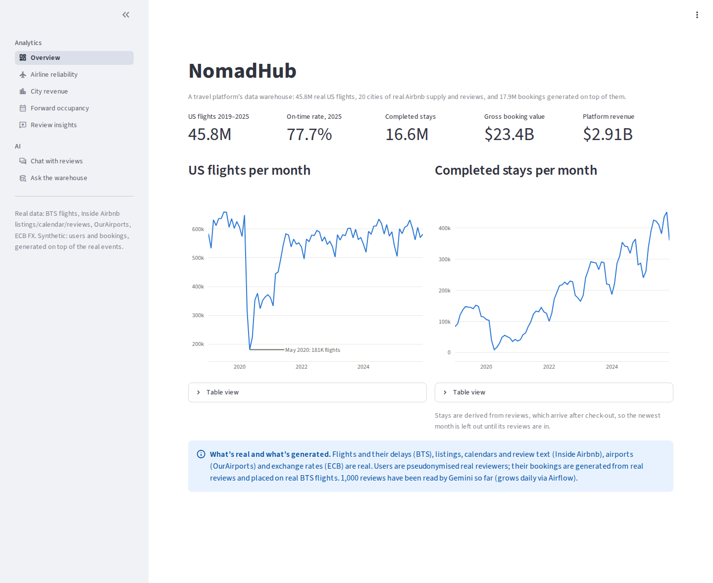
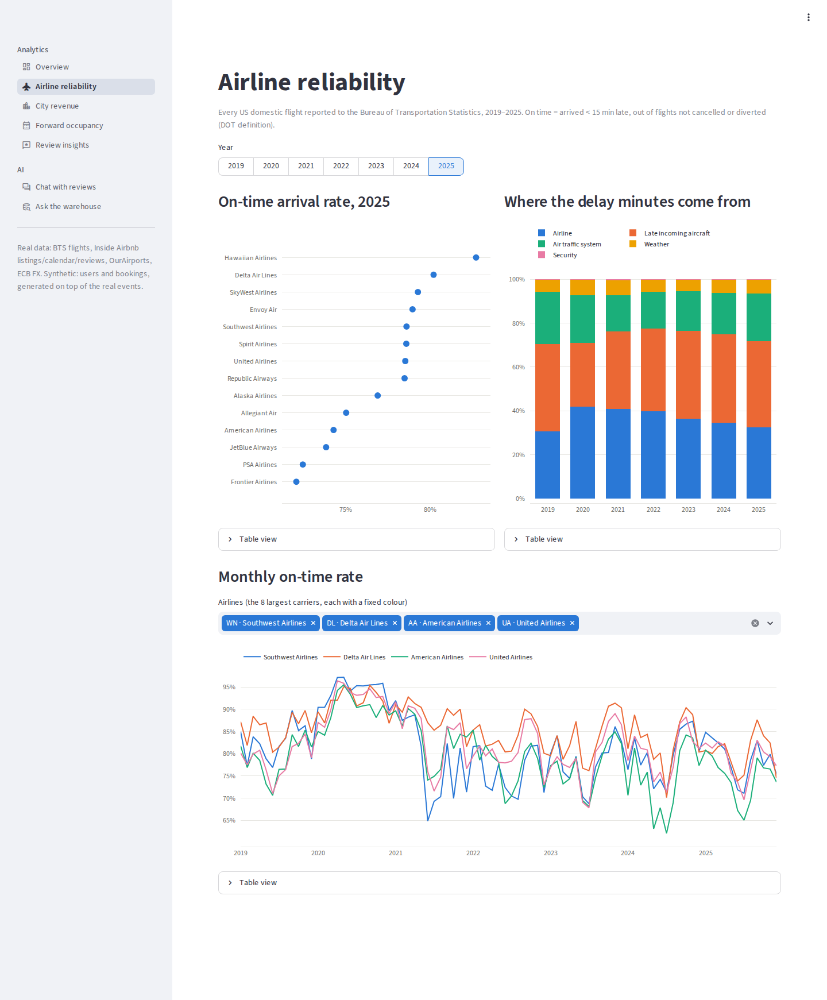
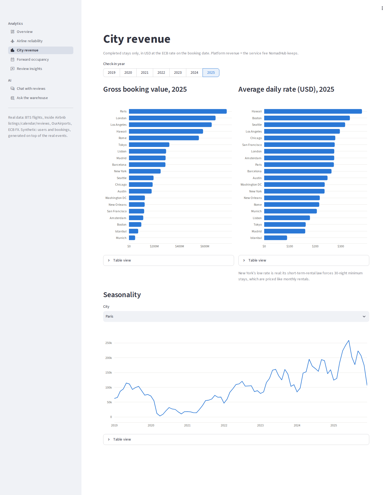
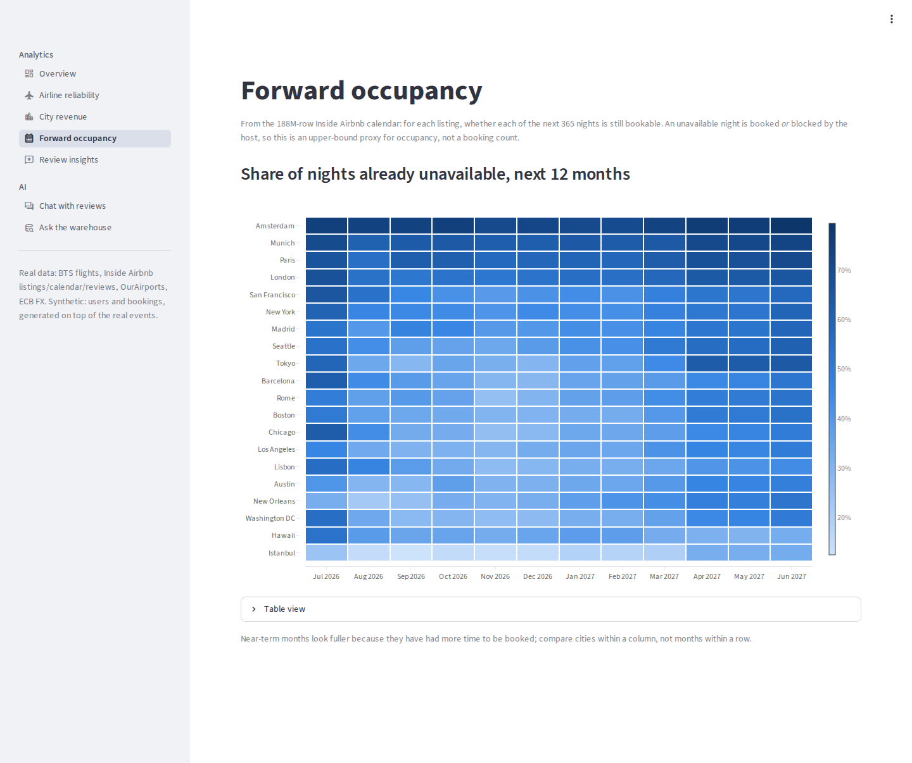
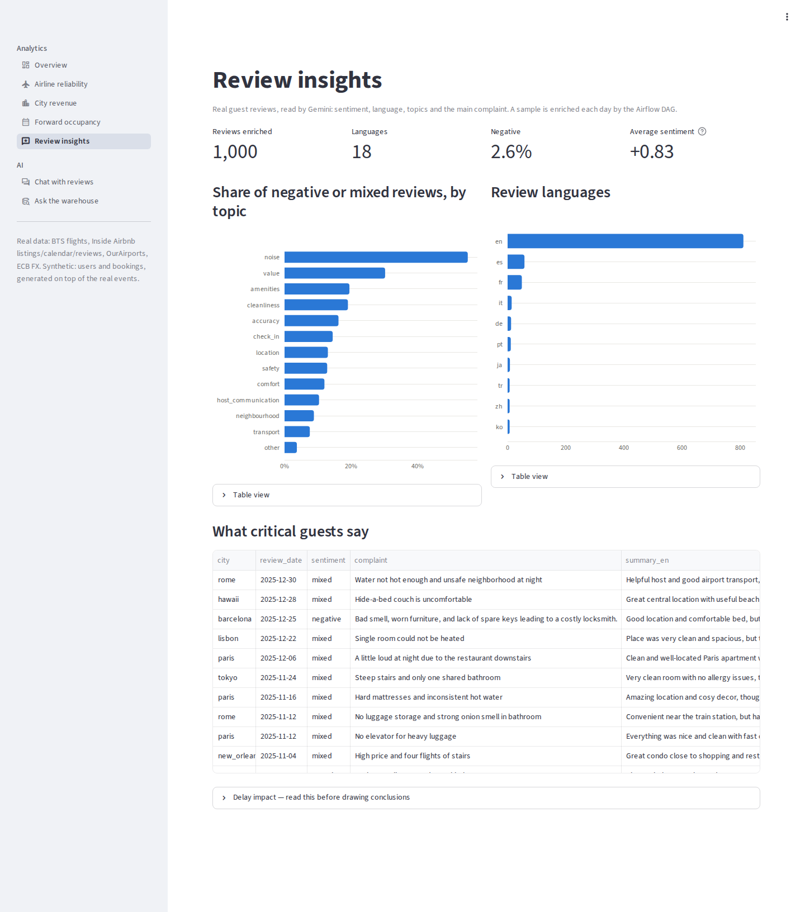
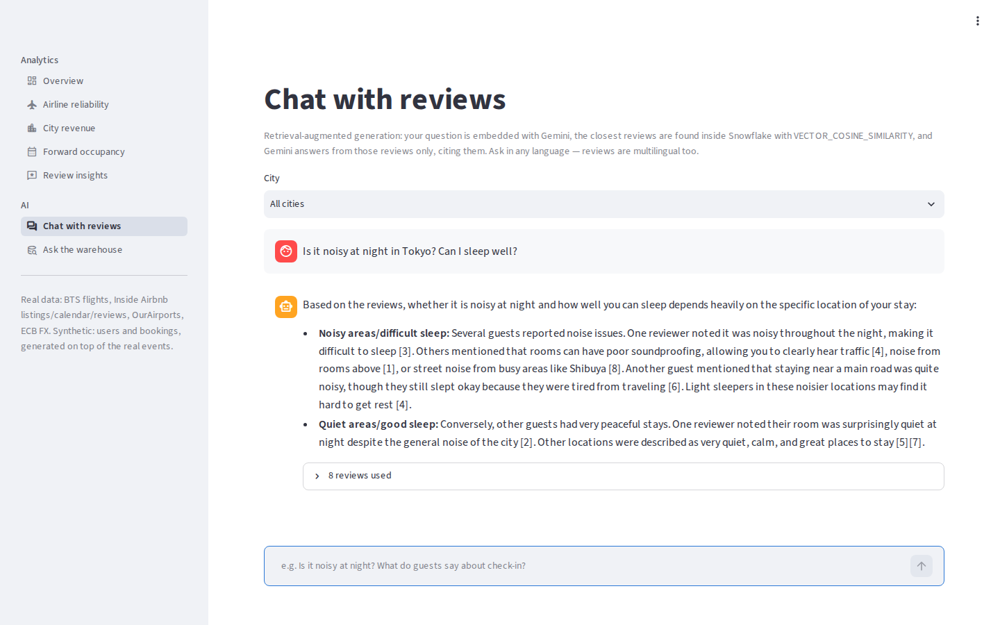
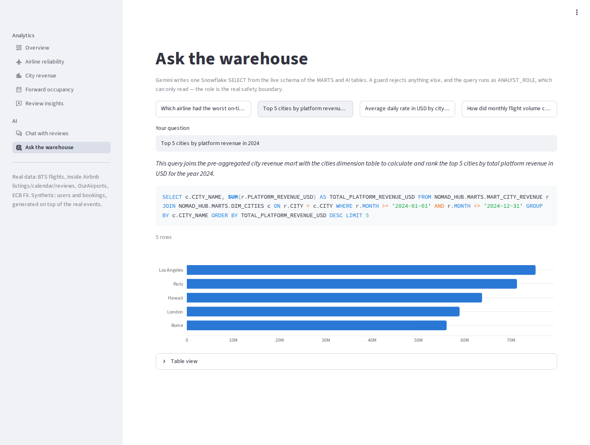
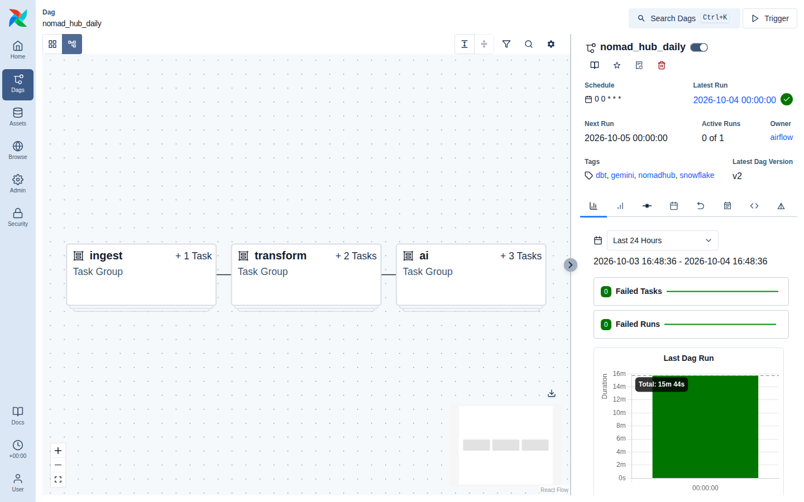

# NomadHub — AI-powered travel data platform

An end-to-end data platform for a fictional travel company, built on **~294 million rows of
real public data**: every US domestic flight from 2019–2025, Airbnb listings, calendars and
reviews for 20 cities, the world's airports, and daily exchange rates. A synthetic booking
layer is generated **on top of** those real events.

**S3 → Snowflake → dbt → Airflow → Gemini (enrichment · RAG · text-to-SQL) → Streamlit**,
with the cloud side fully in **Terraform**.


> Inspired by [darshilparmar/zomato-ai-data-engineering-end-to-end-project](https://github.com/darshilparmar/zomato-ai-data-engineering-end-to-end-project)
> — same layered architecture, rebuilt with real data at ~8× the volume, infrastructure as code,
> key-pair security and an in-warehouse vector store. See [What's different](#whats-different-from-the-reference).

---

## What the data shows

All numbers come from the marts, and anyone with the repo can rebuild them.

- **2020 broke US aviation, and punctuality hasn't recovered.** Flights fell from ~640K/month
  to **181K in May 2020**. That year was the most punctual on record (90% on time, empty skies)
  with 6% of flights cancelled. Punctuality never returned to the 2019 level (80.9%) and hit
  its low in **2025: 77.7%**.
- **The gap between airlines is wide.** In 2025 Hawaiian arrived on time 82.7% of the time,
  Frontier 72.1%. Over the whole period, late-arriving aircraft and the airlines themselves
  cause most delay minutes; weather causes far less.
- **Noise is what guests complain about most.** Out of 1,000 multilingual reviews read by
  Gemini (18 languages), ~55% of those that mention noise are negative or mixed, far ahead of
  value (~30%) and cleanliness.
- **Regulation shows up in behaviour.** New York stays average **16.6 nights**, against 9.9 for
  the next-longest city, because its short-term-rental law forces 30-night minimum stays.

---

## Screenshots

| | |
|---|---|
| **Overview:** 45.8M flights, the May 2020 low, stays per month<br> | **Airline reliability:** on-time ranking, delay causes, monthly trends<br> |
| **City revenue:** GBV and daily rate in USD, seasonality<br> | **Forward occupancy:** 20 cities × 12 months from the 188M-row calendar<br> |
| **Review insights:** what Gemini found in multilingual reviews<br> | **Chat with reviews:** RAG over Snowflake `VECTOR`, cited answers<br> |
| **Ask the warehouse:** Gemini text-to-SQL, read-only role<br> | **Airflow 3:** the daily `nomad_hub_daily` DAG<br> |

Retake them from the running stack with [`scripts/take_screenshots.py`](scripts/take_screenshots.py)
(headless Chromium in a container).

---

## Data — what's real and what's generated

| Table | Rows | Source | Real? |
|---|---|---|---|
| `flights` | 45.8M | [BTS On-Time Performance](https://www.transtats.bts.gov/), 2019-01 → 2025-12 | ✅ real (public domain) |
| `calendar` | 188.3M | [Inside Airbnb](https://insideairbnb.com/get-the-data/), 365-day availability | ✅ real (CC BY 4.0) |
| `reviews` | 22.1M | Inside Airbnb, review text in many languages | ✅ real (CC BY 4.0) |
| `listings` | 514K | Inside Airbnb, 10 US + 10 international cities | ✅ real (CC BY 4.0) |
| `airports` / `countries` / `regions` | 90K | [OurAirports](https://ourairports.com/data/) | ✅ real (public domain) |
| `fx_rates_daily` (seed) | 23K | [ECB reference rates](https://www.ecb.europa.eu/stats/policy_and_exchange_rates/euro_reference_exchange_rates/) | ✅ real |
| `users` | 12.6M | one per real reviewer, **pseudonymised** (fake name, email, home) | 🧪 synthetic attributes |
| `stay_bookings` | 17.9M | one completed stay per real review + cancelled bookings | 🧪 synthetic, anchored on real reviews |
| `flight_bookings` | 6.9M | US travellers placed on **real** BTS flights to their stay's city | 🧪 synthetic, outcomes are real |

No platform publishes its customers, so the generator ([`data/generate_data.py`](data/generate_data.py))
builds only that layer, and always around a real event. A stay checks out shortly before a
real review was written. A flight booking sits on a real flight, so if BTS says that flight
was cancelled, the booking was cancelled too. Personal data (reviewer/host names, profile
URLs) is dropped at download.

---

## Architecture

| Layer | Where | What |
|---|---|---|
| **Sources** | [`data/`](data/) | Resumable downloaders for BTS, Inside Airbnb, OurAirports, ECB; DuckDB generator for the synthetic layer |
| **Lake** | Amazon S3 | `raw/<table>/<partition>/*.csv.gz`, one file per month / city snapshot; versioned, encrypted, private |
| **Bronze** | Snowflake `RAW` | `COPY INTO` through a keyless storage integration; all-VARCHAR tables + `_SOURCE_FILE` / `_LOADED_AT` lineage |
| **Silver** | Snowflake `STAGING` | 10 dbt views: typing (BTS `"0659"` times, `"1.00"` flags), local-currency prices, HTML-free review text, dedup across snapshots |
| **Gold** | Snowflake `MARTS` | 6 dimensions, 3 **incremental MERGE** facts keyed on `_LOADED_AT`, 5 business marts, an SCD2 snapshot of listing prices |
| **AI** | Snowflake `AI` | Gemini review enrichment, **RAG with Snowflake `VECTOR`**, text-to-SQL; 2 AI marts |
| **Orchestration** | Airflow 3.3 (Docker) | One daily DAG: `ingest → transform → ai`; every step incremental |
| **Serve** | Streamlit | 7-page dashboard incl. chat-with-reviews and ask-the-warehouse |
| **Infra** | Terraform | S3, IAM, warehouse + credit cap, database, roles, service users, integration, stage |

**dbt:** 26 models · 94 data tests (keys, relationships, accepted values/ranges, mart grains,
a RAW-to-fact reconciliation test) · 5 seeds · 1 snapshot.

### The AI lane

1. **LLM enrichment:** [`ai/enrich_reviews.py`](ai/enrich_reviews.py) sends 25 reviews per
   Gemini call with a typed JSON schema (sentiment, language, topics, complaint, travel-disruption
   flag, English summary). Failed batches are never written, so they're retried on the next run
   instead of being stored as fake "neutral" rows.
2. **RAG:** [`ai/rag.py`](ai/rag.py) stores embeddings as `VECTOR(FLOAT, 768)` **inside Snowflake**
   and retrieves with `VECTOR_COSINE_SIMILARITY` in SQL. There's no separate vector DB, and the
   same grants apply. Retrieval works across languages: a Turkish question finds Spanish and
   Portuguese reviews.
3. **Text-to-SQL:** [`ai/text_to_sql.py`](ai/text_to_sql.py) reads the live schema, generates
   one SELECT, rejects anything else, and runs as the **read-only** `ANALYST_ROLE`. The role is
   the real safety boundary.

---

## What's different from the reference

| | Reference (Zomato) | NomadHub |
|---|---|---|
| Data | ~33M rows; real dimensions, generated facts | ~294M rows; real facts (flights, reviews, calendar) + anchored synthetic bookings |
| Cloud setup | console clicks + SQL worksheets | **Terraform**, including the S3 ↔ Snowflake trust handshake |
| Snowflake auth | password | **key-pair** service users, 3 least-privilege roles, resource monitor |
| Loading | single files, reloaded daily | gzip files partitioned by month/city; COPY loads only new files |
| Incremental facts | `max(timestamp)` filter | MERGE on the RAW `_LOADED_AT` lineage column |
| LLM enrichment | 1 call per review; failures saved as rows | 25 reviews per call, typed schema; failures retried, never stored |
| Vector store | parquet file on disk | Snowflake `VECTOR` + cosine similarity in SQL |
| Text-to-SQL | runs as the write role | runs as the read-only analyst role |
| Airflow | Airflow 3 | Airflow 3 + isolated dbt/AI virtualenvs, key-mounted containers |
| CI | none | dbt parse + ruff on every PR |

---

## Run it

Everything runs in Docker; the host needs nothing but Docker. One-off commands go through
the **toolbox** container (Terraform, AWS CLI, Python, dbt), long-running services through
Compose. Full step-by-step cloud setup: **[CLOUD.md](CLOUD.md)**. The short version:

```bash
docker compose build
alias nh='docker compose run --rm tools'     # toolbox: repo + ~/.aws + ~/.nomadhub/keys mounted

# 1. Data (≈1–2 h download, ≈4 min generation)
nh python data/download_sources.py all       # BTS, Inside Airbnb, OurAirports, ECB → data/raw/
nh python data/generate_data.py              # users + bookings on top of the real data

# 2. Cloud (one-time manual steps first: see CLOUD.md)
nh terraform -chdir=terraform init && nh terraform -chdir=terraform apply
nh scripts/upload_raw.sh
nh python scripts/run_sql.py snowflake/01_raw_tables.sql
nh python scripts/run_sql.py snowflake/02_copy_into.sql

# 3. Transform
nh dbt deps  --project-dir nomad_hub
nh dbt build --project-dir nomad_hub --exclude tag:ai

# 4. AI (needs GEMINI_API_KEY in .env)
nh python ai/enrich_reviews.py --limit 500
nh python ai/rag.py index --limit 20000
nh dbt build --project-dir nomad_hub --select tag:ai

# 5. Orchestrate + serve (the daily DAG then repeats steps 2-4 incrementally)
docker compose --profile app up -d           # Airflow :8080 (admin/admin) · dashboard :8501
```

Smaller dev set: `download_sources.py all --sample` and `generate_data.py --sample`
(1 BTS month, 2 cities).

**Cost.** S3 ≈ $0.15/month. Snowflake runs on the $400 trial credit, and the whole build
uses a few credits on an X-Small warehouse capped by a resource monitor. Gemini: enriching
500 reviews and embedding 20K costs well under $1.

---

## Repository

```
├── data/                 downloaders (sources/), synthetic generator, data/raw/ (gitignored)
├── terraform/            AWS + Snowflake infrastructure
├── snowflake/            bootstrap SQL, RAW tables, COPY INTO, security policies
├── scripts/              key generation, S3 upload, run a SQL file
├── nomad_hub/            dbt project (staging, marts, ai, seeds, snapshot, tests)
├── ai/                   Gemini enrichment, RAG, text-to-SQL
├── airflow/              Dockerfile + DAG
├── dashboard/            Streamlit app
├── tools/                toolbox image for one-off commands (dbt, Python, Terraform, AWS CLI)
├── docs/                 architecture diagram
├── docker-compose.yaml   Airflow 3 + dashboard + toolbox
└── CLOUD.md              cloud setup guide
```

---

## Honest limits

- **Bookings are synthetic.** They're anchored on real reviews and flights, but the link
  between a reviewer and a flight is generated. `mart_delay_impact` (does a delayed arrival
  show up in the review?) therefore shows *no* effect and is kept only as a demonstration of
  the join, not a finding.
- **Occupancy is a proxy.** An unavailable calendar night is booked *or* blocked by the host.
- **AI coverage is a sample.** 1,000 reviews are enriched and 22.9K embedded, out of 22M.
  The DAG adds more every day.
- **Flights are US-only** (BTS), so international stays have no flight leg.

## Credits & licences

Flight data: US Bureau of Transportation Statistics (public domain). Listings, calendars and
reviews: [Inside Airbnb](https://insideairbnb.com), CC BY 4.0. Airports: OurAirports (public
domain). Exchange rates: Source: ECB. Code: MIT.
