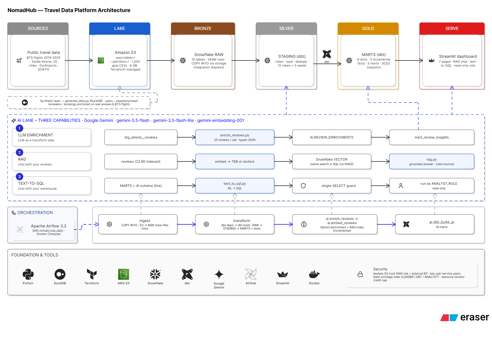

# NomadHub ✈️ — AI-Powered Travel Data Engineering

> **End-to-end batch data pipeline** for a travel & booking platform — from raw CSVs to AI-powered analytics, built as a portfolio project.



[](https://python.org)
[](https://getdbt.com)
[](https://snowflake.com)
[](https://airflow.apache.org)
[](https://aistudio.google.com)
[](https://streamlit.io)
[](https://aws.amazon.com/s3)

---

## What is NomadHub?

NomadHub simulates a real-world travel & booking platform's data infrastructure. The pipeline ingests flight reservations, hotel bookings, and customer reviews — transforming raw data through **medallion layers** (Bronze → Silver → Gold) and enriching it with **AI capabilities** powered by Google Gemini.

### Data Scale
| Table | Description | Rows |
|---|---|---|
| `countries` | Country & city reference | ~250 |
| `airports` | Airport catalog (IATA codes) | ~10K |
| `hotels` | Hotel profiles & categories | ~50K |
| `users` | User accounts & profiles | ~1M |
| `flights` | Flight bookings (**FACT**) | **~12M** |
| `hotel_bookings` | Hotel reservations (**FACT**) | **~15M** |
| `reviews` | Free-text travel reviews | **~400K** |

---

## Architecture

```
SOURCE              LAKE          BRONZE            SILVER           GOLD            SERVE
NomadHub        →  Amazon S3  →  Snowflake RAW  →  STAGING (dbt) →  MARTS (dbt)  →  Streamlit
Dataset            raw/           COPY INTO         clean·type·      dims·incr.       BI Dashboard
7 CSVs             7 folders      storage int.      join·views       facts·marts      AI Chat Apps

AI LANE  ·  THREE CAPABILITIES  ·  Google Gemini
━━━━━━━━━━━━━━━━━━━━━━━━━━━━━━━━━━━━━━━━━━━━━━━━━━━━━━━━━━━━━━━━━━━━━━━━━━━━━
① LLM ENRICHMENT   stg_reviews → enrich_reviews.py → AI.REVIEW_ENRICHED → mart_review_insights
② RAG              reviews     → embed→vectors      → FAISS store      → rag_chat.py
③ TEXT-TO-SQL      MARTS schema→ text_to_sql.py     → SELECT guard     → run as DBT_ROLE

ORCHESTRATION  ·  Apache Airflow 3 (Docker)  ·  TaskGroup-based modular DAG
━━━━━━━━━━━━━━━━━━━━━━━━━━━━━━━━━━━━━━━━━━━━━━━━━━━━━━━━━━━━━━━━━━━━━━━━━━━━
[ingest] → [transform] → [ai_enrich] → [ai_marts]
```

---

## Tech Stack

| Layer | Technology |
|---|---|
| Language | Python 3.11, SQL |
| Data Lake | Amazon S3 |
| Data Warehouse | Snowflake |
| Transformation | dbt (dbt-snowflake 1.8) |
| Orchestration | Apache Airflow 3.0 (Docker) |
| AI / LLM | Google Gemini 1.5 Flash |
| AI / Embeddings | Google text-embedding-004 |
| Vector Store | FAISS (local) |
| Serving | Streamlit |
| CI/CD | GitHub Actions |

---

## Repository Structure

```
nomad-hub-data-engineering/
├── data/
│   └── generate_data.py          # Synthetic data generator (Faker + Pandas)
├── aws/
│   ├── iam/s3_policy.json        # Minimum-privilege S3 IAM policy
│   └── upload_to_s3.py           # Parallel S3 upload with progress bars
├── snowflake/
│   ├── 01_setup.sql              # Warehouse, DB, schemas, roles
│   ├── 02_storage_integration.sql# Keyless S3 → Snowflake link
│   ├── 03_stage_and_formats.sql  # External stage + CSV file format
│   ├── 04_raw_tables.sql         # Bronze DDL (7 tables)
│   ├── 05_copy_into.sql          # COPY INTO from S3 stage
│   └── 06_row_access_policies.sql# Row-level security example
├── nomad_hub/                    # dbt project
│   ├── models/staging/           # 7 Silver views
│   ├── models/marts/             # Dims + Incremental Facts + 5 Business Marts
│   └── macros/                   # Custom schema routing + generic tests
├── airflow/
│   ├── Dockerfile
│   ├── docker-compose.yaml
│   ├── example.env
│   └── dags/nomad_pipeline.py    # 4-TaskGroup modular DAG
├── ai/
│   ├── enrich_reviews.py         # Gemini batch enrichment
│   ├── rag_chat.py               # RAG "chat with reviews" (Streamlit)
│   ├── text_to_sql.py            # NL→SQL assistant (Streamlit)
│   └── example.env
├── streamlit/
│   └── app.py                    # Multi-page BI dashboard + AI apps
└── .github/
    └── workflows/dbt_ci.yml      # dbt compile + test on PR
```

---

## Quick Start

### Prerequisites
- Python 3.11+
- Docker & Docker Compose
- AWS account (S3 bucket)
- Snowflake account (trial is fine)
- Google AI Studio API key (free): https://aistudio.google.com/

### 1. Generate Synthetic Data
```bash
cd data
pip install faker pandas pyarrow tqdm
python generate_data.py
# Produces: countries.csv, airports.csv, hotels.csv, users.csv,
#           flights.csv (~12M rows), hotel_bookings.csv (~15M rows), reviews.csv (~400K rows)
```

### 2. Upload to S3
```bash
cd aws
pip install boto3 tqdm
# Configure AWS credentials: aws configure
python upload_to_s3.py --bucket your-nomad-hub-bucket --data-dir ../data
```

### 3. Snowflake Setup
Run SQL files in Snowsight in order:
```
snowflake/01_setup.sql
snowflake/02_storage_integration.sql  ← requires AWS ARN from step 2
snowflake/03_stage_and_formats.sql
snowflake/04_raw_tables.sql
snowflake/05_copy_into.sql
```

### 4. dbt Transformation
```bash
cd nomad_hub
pip install dbt-snowflake
cp profiles.yml.example ~/.dbt/profiles.yml
# Edit ~/.dbt/profiles.yml with your Snowflake credentials
dbt deps
dbt run
dbt test
```

### 5. Airflow Orchestration
```bash
cd airflow
cp example.env .env
# Edit .env with your credentials
docker compose up -d
# Open: http://localhost:8080  (admin / admin)
# Trigger DAG: nomad_hub_pipeline
```

### 6. AI Layer
```bash
cd ai
cp example.env .env
# Edit .env with GEMINI_API_KEY + Snowflake credentials
pip install google-generativeai faiss-cpu streamlit snowflake-connector-python

# Run LLM enrichment (can also run via Airflow)
python enrich_reviews.py

# Launch AI apps
streamlit run rag_chat.py          # Chat with reviews
streamlit run text_to_sql.py       # Query warehouse in natural language
```

### 7. Full Dashboard
```bash
cd streamlit
pip install streamlit plotly pandas snowflake-connector-python
streamlit run app.py
# Open: http://localhost:8501
```

---

## dbt Data Lineage

```
RAW.flights           → stg_flights        → fct_flights (INCREMENTAL)      ─┐
RAW.hotel_bookings    → stg_hotel_bookings → fct_hotel_bookings (INCREMENTAL)─┤
RAW.hotels            → stg_hotels         → dim_hotels (SCD2 snapshot)      ─┼─→ mart_revenue_summary
RAW.airports          → stg_airports       → dim_destinations                ─┤    mart_destination_perf
RAW.users             → stg_users          → dim_users                       ─┤    mart_cancellation
RAW.countries         → stg_countries      ─────────────────────────────────-┘    mart_user_cohort
RAW.reviews           → stg_reviews        → AI.REVIEW_ENRICHED              ──→  mart_review_insights
```

---

## Key Design Decisions

1. **Gemini over OpenAI** — Google's `text-embedding-004` matches OpenAI's `text-embedding-3-small` quality at lower cost with a generous free tier.
2. **TaskGroup DAG** — Each pipeline stage is a self-contained TaskGroup; failures are isolated and retryable per stage.
3. **MERGE-based incremental models** — `fct_flights` and `fct_hotel_bookings` use `unique_key` MERGE to handle late-arriving data without full refresh.
4. **3-role Snowflake security** — `NOMAD_ADMIN`, `DBT_ROLE` (transform), `ANALYST_ROLE` (read-only) follows least-privilege principle.
5. **FAISS vector store** — Keeps the RAG component self-contained without additional managed services.

---

## License

MIT — feel free to fork and adapt for your own portfolio.
